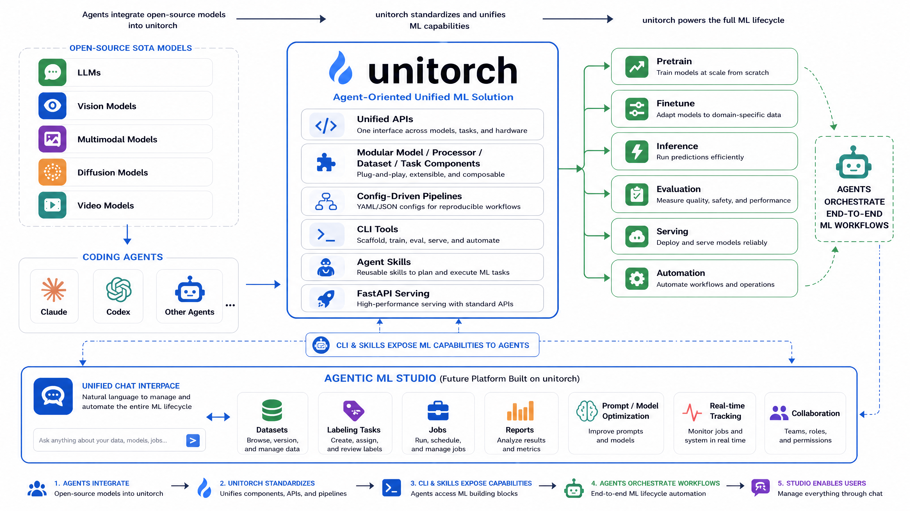

<div align="center">


[Documentation](https://fuliucansheng.github.io/unitorch) •
[Installation](https://fuliucansheng.github.io/unitorch/installation/) •
[Report Issues](https://github.com/fuliucansheng/unitorch/issues/new?assignees=&labels=&template=bug-report.yml)

[](https://pypi.org/project/unitorch/)
[](https://badge.fury.io/py/unitorch)
[](https://pepy.tech/project/unitorch)
[](https://img.shields.io/github/downloads/fuliucansheng/unitorch/total?color=blue&label=Downloads&logo=github&logoColor=lightgrey)
[](LICENSE)
[](https://github.com/fuliucansheng/unitorch/issues?q=is%3Aopen+is%3Aissue+label%3A%22help+wanted%22)

</div>

## Introduction

🔥 **unitorch** is an agent-oriented, future-facing unified ML solution built on top of PyTorch. It combines a reusable modeling foundation with configuration-driven CLIs, FastAPI serving, copilot tools, and exportable skills so human users and coding agents can operate the full ML lifecycle: discover components, prepare configs, train, evaluate, run inference, serve models, and automate workflows.

unitorch still wraps state-of-the-art models across NLP, computer vision, multimodal learning, diffusion, and generation, with seamless integrations for [transformers](https://github.com/huggingface/transformers), [peft](https://github.com/huggingface/peft), and [diffusers](https://github.com/huggingface/diffusers). The goal is broader than unified modeling: unitorch provides an inspectable operational layer that agents can invoke, extend, and compose.

Get started with a single import, a one-line CLI command, or an agent-readable skill - no boilerplate required.

## Features

| | |
|---|---|
| **Agent-Oriented ML Lifecycle** | Discover, configure, train, evaluate, infer, serve, and automate ML workflows |
| **CLI and Skills Layer** | Agent-readable commands, copilot tools, and generated skills for repeatable execution |
| **Unified Model Foundation** | 20+ architectures: LLMs, diffusion models, vision transformers, multimodal models |
| **Configuration-Driven CLI** | Train, evaluate, infer, and serve via `.ini` config files |
| **Multi-GPU & Distributed** | Native `torchrun` support + DeepSpeed integration for large-scale models |
| **CUDA Optimized** | Optional CUDA C++ extensions for accelerated kernels |
| **PEFT / LoRA** | Built-in parameter-efficient fine-tuning support |
| **Agent-Ready Serving** | FastAPI serving and remote copilot clients for model-backed tools |

## Overall Design



unitorch is designed as a bridge between open-source state-of-the-art models,
agent systems, and practical ML workflows.

1. **Agent-assisted model integration**: coding agents such as Claude, Codex,
   and other agent systems can help integrate open-source SOTA models into
   unitorch. Once integrated, these models reuse the same modular components,
   unified APIs, configuration system, pipelines, and serving interfaces for
   pretraining, finetuning, inference, evaluation, and deployment.
2. **ML capabilities for agents**: unitorch exposes model and workflow
   capabilities through CLI commands, FastAPI services, copilot tools, and
   generated skills. This gives agents a practical ML execution layer they can
   discover, invoke, and compose inside user scenarios.
3. **Foundation for Agentic ML Studio**: unitorch can serve as the base of an
   agentic ML studio: a chat-first platform where users interact with datasets,
   labeling tasks, jobs, reports, prompt optimization, model training,
   inference, evaluation, real-time tracking, and collaboration workflows
   through natural language or internal commands.

## Installation

```bash
pip install unitorch
```

<details>
<summary>Optional extras</summary>

```bash
pip install "unitorch[all]"          # everything
pip install "unitorch[deepspeed]"    # DeepSpeed support
pip install "unitorch[diffusers]"    # image generation models
```

Requires **Python >= 3.10** and **PyTorch 2.5+**.
</details>

## Quick Start

**Python API**
```python
from unitorch.models.bart import BartForGeneration
model = BartForGeneration("path/to/bart/config.json")

# Configuration-driven setup
from unitorch.cli import Config
config = Config("path/to/config.ini")
```

**Multi-GPU Training**
```bash
torchrun --no_python --nproc_per_node 4 \
    unitorch-train examples/configs/generation/bart.ini \
    --train_file path/to/train.tsv --dev_file path/to/dev.tsv
```

**Inference**
```bash
unitorch-infer examples/configs/generation/bart.ini --test_file path/to/test.tsv
```

**Agent and Skill Tools**
```bash
unitorch-copilot-cli core/copilot/pkg_infos --name model
python3 -m unitorch.cli.copilots.skills install --folder ./skills
```

> See the [documentation](https://fuliucansheng.github.io/unitorch) for full tutorials and examples.

## Supported Models

<details>
<summary>View all supported models</summary>

| Domain | Models |
|--------|--------|
| **Language** | BERT, RoBERTa, XLM-RoBERTa, BART, MBart, LLaMA, Mistral, QWen3, Gemma 4 |
| **Vision** | BEiT, Swin Transformer, DINOv2, CLIP, SigLIP |
| **Multimodal** | LLaVA, QWen3-VL, Gemma 4-VL, Chinese CLIP |
| **Image Generation** | FLUX (StableFlux), QWenImage |
| **Video Generation** | Wan (Wan2.2 TI2V-5B), Lucy Edit 1.1 Dev |
| **Detection** | DETR, Grounding DINO |
| **Segmentation** | SAM, Mask2Former, SegFormer, BRIA |
| **Depth Estimation** | DPT |
| **PEFT** | LoRA, DPO, GRPO (via peft wrappers) |

</details>

## CLI Commands

| Command | Purpose |
|---------|---------|
| `unitorch-train` | Train models (supports `torchrun`) |
| `unitorch-eval` | Evaluate models |
| `unitorch-infer` | Run batch inference |
| `unitorch-fastapi` | Start a FastAPI model server |
| `unitorch-copilot` | unitorch-native agent for ML workflows |
| `unitorch-copilot-cli` | Agent-facing CLI that invokes registered copilot tools and exposes component metadata |

## License

Released under the [MIT License](LICENSE).