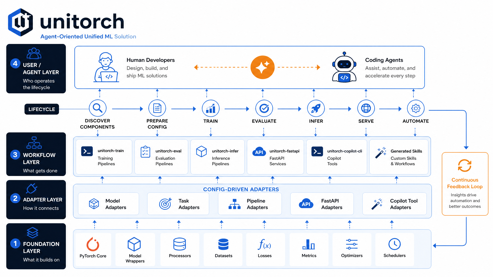

---
hide:
  - toc
---

# Overview

&nbsp;&nbsp;&nbsp;&nbsp;&nbsp;&nbsp;**unitorch** is an agent-oriented, future-facing unified ML solution built around a Foundation-Adapter architecture. It provides reusable PyTorch model foundations, workflow adapters, configuration-driven CLIs, FastAPI serving, copilot tools, and exportable skills so humans and coding agents can operate the full ML lifecycle across natural language understanding, natural language generation, computer vision, multimodal learning, diffusion, generation, and more.

&nbsp;&nbsp;&nbsp;&nbsp;&nbsp;&nbsp;The goal of unitorch is broader than unified modeling. Model wrappers remain a core foundation, but the project also exposes an inspectable operational layer for agents: components can be listed, configured, invoked locally, served remotely, and documented as skills for repeated use.

&nbsp;&nbsp;&nbsp;&nbsp;&nbsp;&nbsp;The architecture of unitorch consists of four connected layers: **Foundation Modules**, **Adapter Modules**, **Command Line Interface (CLI)**, and **Copilot and Skills Interfaces**.

**Foundation Modules**: focus on implementing the core functionality of the package and provide the basic functions required by the models. These modules serve as the building blocks for different workflows and are designed to be modular, efficient, and flexible.

**Adapter Modules**: act as adapters for the Foundation Modules, enabling them to support different workflows. Since different tasks or applications may have unique requirements, Adapter Modules provide the necessary interfaces and configurations to adapt the Foundation Modules to specific use cases. This modular approach allows for easy customization and extensibility of the package.

**Command Line Interface (CLI)**: defines repeatable workflows for unitorch. The CLI orchestrates pipelines by calling the required Adapter Modules based on the configuration design. These commands simplify training, evaluation, inference, serving, and deployment, while also giving agents stable command surfaces they can inspect and execute.

**Copilot and Skills Interfaces**: expose unitorch functionality as agent-facing tools, Python adapters, remote clients, and generated skill documents. This layer makes unitorch workflows easier for agents to discover, parameterize, invoke, and reuse across projects.

* `unitorch-train` command is used to train models using the unitorch package. It enables you to specify the training data, model architecture, hyperparameters, and other configuration options. By Running this command, the package will utilize the specified data and parameters to train the model and optimize its performance based on the defined objective.
* `unitorch-infer` command is used for inference or prediction using trained models. Once a model has been trained using unitorch-train, you can employ this command to make predictions or generate outputs for new or unseen data. It takes the trained model and the input data as inputs and produces the predicted results using the learned patterns and knowledge captured during training.
* `unitorch-eval` command is used to evaluate the performance of trained models. It allows you to assess the quality and effectiveness of the model by comparing its predictions against the ground truth or reference data. This command typically computes various metrics, such as accuracy, precision, recall, F1 score, or other domain-specific metrics, to provide insights into the model's performance.
* `unitorch-fastapi` command is used to launch a FastAPI model serving server. It exposes REST API endpoints backed by unitorch models and pipelines, making it easy to integrate model inference into applications.
* `unitorch-copilot` command launches the unitorch-native agent for ML workflows.
* `unitorch-copilot-cli` command invokes registered copilot tools by name, lists component metadata, and provides an agent-friendly entry point for automation.

&nbsp;&nbsp;&nbsp;&nbsp;&nbsp;&nbsp;In addition to the CLI, unitorch also offers a simple import statement (`import unitorch`) that allows users to leverage the functionality of the package with just a single line of code. This import statement provides access to the state-of-the-art models, datasets, processors, and utilities supported by unitorch, while the CLI and skills layers turn those capabilities into repeatable lifecycle operations.

&nbsp;&nbsp;&nbsp;&nbsp;&nbsp;&nbsp;Overall, unitorch empowers developers, researchers, and agents to build, evaluate, deploy, and automate ML systems across domains. By combining a transparent modeling foundation with adapter modules, CLI workflows, FastAPI services, copilot tools, and generated skills, unitorch is designed to be a unified solution for the next generation of ML operations, not only a unified modeling package.